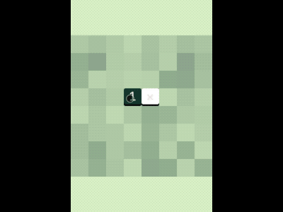

### Hi there! I'm Maicon Feldhaus 👋

<!--
**feldhaus/feldhaus** is a ✨ _special_ ✨ repository because its `README.md` (this file) appears on your GitHub profile.

Here are some ideas to get you started:

- 🔭 I’m currently working on ...
- 🌱 I’m currently learning ...
- 👯 I’m looking to collaborate on ...
- 🤔 I’m looking for help with ...
- 💬 Ask me about ...
- 📫 How to reach me: ...
- 😄 Pronouns: ...
- ⚡ Fun fact: ...

### 👨🏻‍💻 &nbsp;About Me

💡 &nbsp;TODO.\
🎓 &nbsp;TODO.\
🌱 &nbsp;TODO.\
✍️ &nbsp;TODO.\
💬 &nbsp;TODO.\
✉️ &nbsp;TODO.\
📄 &nbsp;TODO!

-->

### Tools & Technologies

&nbsp;
&nbsp;
&nbsp;
&nbsp;
&nbsp;
&nbsp;
&nbsp;
&nbsp;
&nbsp;
&nbsp;
&nbsp;
&nbsp;

### Projects

||||
|:---:|:---:|:---:|
|  |  |  |
| C# / Unity | C# / Unity | C# / Unity |
|  |  |  |
| Unity/C# | Unity/C# | Unity/C# |
|  |  |  |
| ActionScript / Flash Builder | ActionScript / Flash Builder | Lua / Corona Engine |
|  |  |  |
| Lua / Corona Engine | Lua / Corona Engine | Lua / Corona Engine |

### Personal Projects

||||
|:---:|:---:|:---:|
|  |  |  |
| JavaScript / Pixi.js | JavaScript / Phaser | JavaScript / Phaser |
|  |  |  |
| TypeScript / Phaser | TypeScript / Phaser | Typecript / Three.js |

### Reach Me

    
    
    

